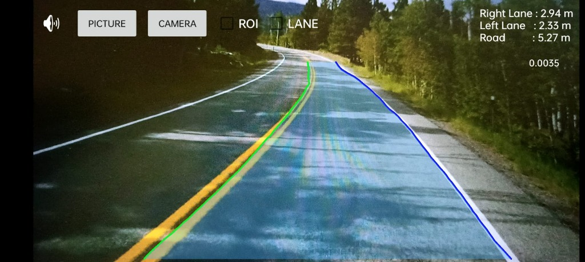
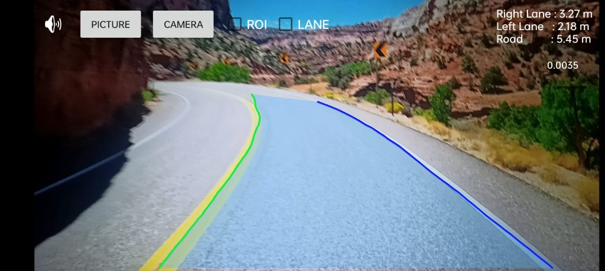

# 🚗 Lane Vision AI — Real-Time ADAS Lane Detection

[](https://developer.android.com)
[](https://www.tensorflow.org/lite)
[](https://opencv.org/)
[](https://www.java.com)

An on-device **Advanced Driver Assistance System (ADAS)** Android app providing real-time lane boundary detection, drivable corridor segmentation, live telemetry (distance to left/right lanes and road width), and lane departure warnings.

---

### 📸 Live Detection Demo

| Forest Curve Road With Tree Shadows | Canyon Road With Curves |
|:---:|:---:|
|  |  |

> **HUD Overlays:** 🟢 Left Ego-Lane &nbsp;|&nbsp; 🔵 Right Ego-Lane &nbsp;|&nbsp; 🟦 Drivable Corridor Polygon &nbsp;|&nbsp; 📏 Live Lane Telemetry in meters

---

## ⚡ Highlights for Reviewers / Interviewers

- **Dual-Engine Vision Pipeline:**
  - **Deep Learning (Primary):** On-device **TensorFlow Lite (UFLD)** model trained on the TuSimple benchmark with **Android NNAPI** acceleration.
  - **Classical CV (Fallback/Reference):** OpenCV pipeline utilizing Gaussian Blur, Canny edge detection, trapezoidal ROI masking, and Probabilistic Hough Transform (`HoughLinesP`).
- **ADAS Safety Features:** Visual blinking warnings and audible alarms when vehicle drifts within `< 0.7m` of either boundary.
- **Real-Time Optimization:** Frame-skipping inference strategy (TFLite runs on every 3rd frame with frame caching) to maintain smooth UI rendering and low thermal footprint.
- **Configurable Calibration:** Live runtime scaling factor (`factor = 0.0035`) for pixel-to-meter ground plane projection.

---

## 🧠 TensorFlow Lite Deep Learning Pipeline

The core intelligence is powered by **Ultra-Fast Lane Detection (UFLD)**, treating lane detection as row-based classification across predefined anchors.

```
Camera Frame (RGBA)
       │
       ▼
1. Preprocessing       ➔ Resize to 800×288 RGB, ImageNet Normalize (Mean/Std)
       │
       ▼
2. TFLite Inference    ➔ Model: assets/lane_model.tflite | Threads: 2 | NNAPI: Enabled
       │                  Input: [1, 800, 288, 3]  ──▶  Output: [1, 101, 56, 4]
       ▼
3. Post-Processing     ➔ 101 grid positions across 56 TuSimple row anchors & 4 lanes
       │                  Softmax + Weighted Argmax: E[x] = Σ (P(i) * i)
       ▼
4. Rendering & ADAS    ➔ Imgproc.polylines + Imgproc.fillPoly (drivable corridor)
                          Lane departure check (< 0.7m threshold)
```

### 🔬 Technical Model Specifications

| Parameter | Specification | Technical Detail |
|---|---|---|
| **Model Format** | FlatBuffer (`.tflite`) | Stored in `app/src/main/assets/lane_model.tflite` (Git LFS) |
| **Input Shape** | `[1, 800, 288, 3]` | Float32 buffer normalized via ImageNet stats (`mean=[0.485, 0.456, 0.406]`, `std=[0.229, 0.224, 0.225]`) |
| **Output Shape** | `[1, 101, 56, 4]` | 101 horizontal grid cells × 56 row anchors × 4 lanes (Far-L, Ego-L, Ego-R, Far-R) |
| **Decoding** | Soft-Argmax | Continuous sub-pixel expected position calculation avoiding discretization error |
| **Hardware Delegate**| NNAPI / Multi-threading | 2 threads with Android Neural Networks API hardware delegation |

---

## 🛠️ Classical OpenCV Pipeline (`LaneDetector1`)

For side-by-side comparison, a traditional computer vision pipeline is also implemented:

1. **Preprocessing:** `RGBA` ➔ Grayscale (`COLOR_RGBA2GRAY`) ➔ 5×5 Gaussian Blur.
2. **Edge Extraction:** Canny Edge Detection (`thresholds: 150, 200`) followed by 3×3 morphological dilation.
3. **Region of Interest (ROI):** Trapezoidal dynamic mask isolating the drivable road perspective.
4. **Feature Extraction:** Probabilistic Hough Transform (`HoughLinesP`).
5. **Filtering & Averaging:** Slope filtering (`|slope| ∈ [0.5, 3.0]`), grouping left vs. right lines, and extrapolating ego-lane boundaries.

---

## 📐 Telemetry & Lane Departure Warning (LDW)

```
Dist to Left Lane  = |Frame_Width / 2 - Left_Lane_X|  × factor
Dist to Right Lane = |Right_Lane_X - Frame_Width / 2| × factor
Road Width         = |Right_Lane_X - Left_Lane_X|     × factor
```

- **Alert Trigger:** If `distToLeftLane <= 0.7m` or `distTorightLane <= 0.7m`.
- **Feedback:** Blinking visual indicator (`AlphaAnimation`, 3 cycles) + audio warning (`alert.mp3`) with a 1-second debounce cooldown.

---

## 📂 Key Source Code Structure

```text
app/src/main/
├── assets/
│   └── lane_model.tflite          # Pretrained UFLD TFLite model
├── java/com/aaron/lanevisionai/
│   ├── videoClass.java            # Main CameraActivity, lifecycle, HUD, LDW alerts
│   ├── LaneDetectorTFLite.java    # TFLite inference, normalization, soft-argmax decoder
│   ├── LaneDetector1.java         # Classical OpenCV Canny + Hough pipeline
│   ├── InstructionsActivity.java  # Animated onboarding screen
│   └── TextFormatter.java         # Real-time HUD telemetry styling
└── res/layout/
    └── roadvideo_land.xml         # Fullscreen landscape UI layout with HUD
```

---

## 🚀 Quick Start

1. **Clone the repository:**
   ```bash
   git clone https://github.com/aaronmohan/Lane_Vision_AI_Tensorflow.git
   ```
2. **Open in Android Studio** and sync project with Gradle files.
   - **Requirements:** Android SDK API 24+ (Android 7.0+), Camera permission.
3. **Run on a physical device** for optimal camera and NNAPI hardware acceleration.

